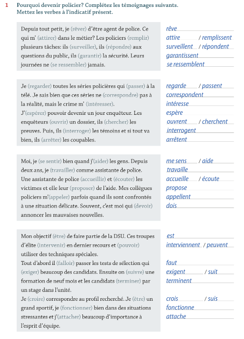
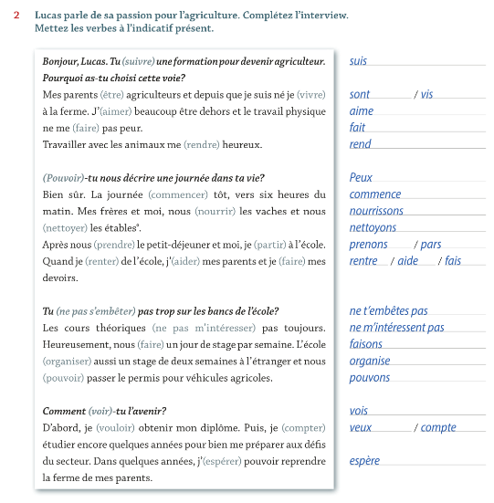
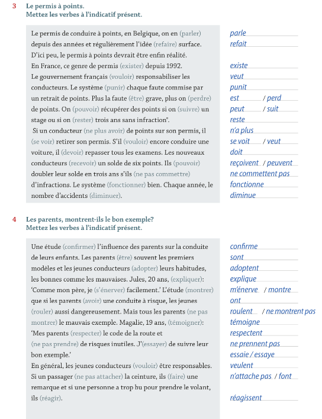
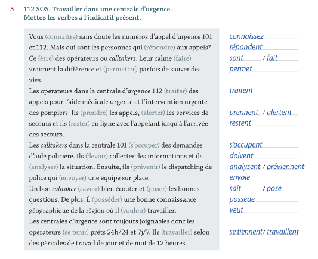
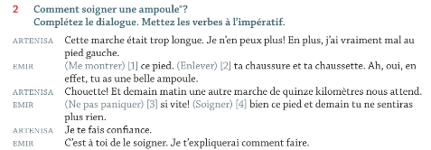
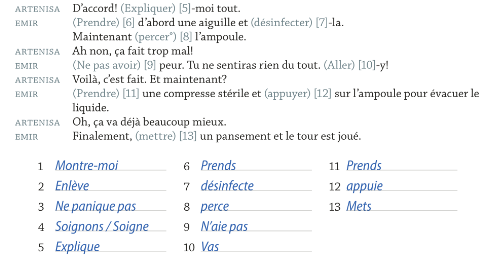
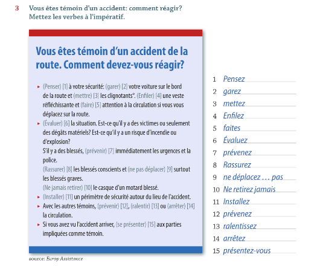
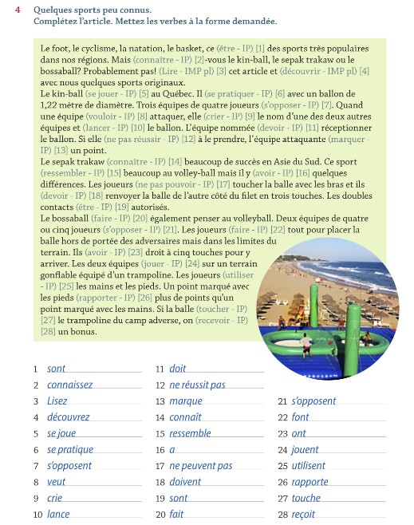
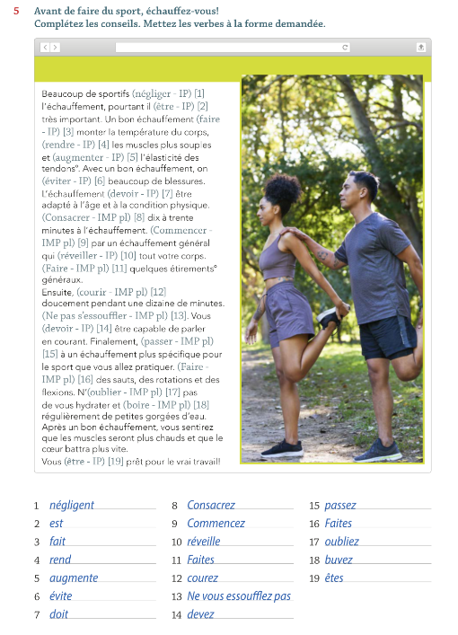

# Frans - Examen 1

---

## Trajet 1 - Appeler les secours
### Décrire Le Risques

### Signaler Un Problème

### Mots-clés

### Les Indéfinis

---

## Trajet 1 - Éviter les problèmes
### Donner Des Instructions

### Les Pronoms Relatifs

### Le Préposition De

## La conjugaison de verbes

### Indicatif Present

### Impératif 

---

