# Aardrijkskunde - Examen 1

---

## Thema 1 - De kosmos

---

### Hoofdstuk 2 - De structuur van het heelal

### 1. Afstanden in het heelal

### 1.1 De Astronomische eenheid (AE)
- Astronomische eenheid = **gemiddelde** afstand tussen de zon en de aarde (150 000 000 kilometer)
- Afstanden binnen het zonnestelsel

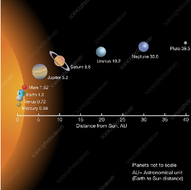

### 1.2 Lichtjaar (LJ)
- **Lichtjaar** = afstand die het licht aflegt op één jaar tijd (10 biljoen kilometer)
- **Snelheid van het licht** = 300 000 kilometer/seconde
- **Zon** -> **Aarde** = 8 lichtminuten

### Toepassing:
- Supernova van 160 000 jaar geleden (James Webb Space Telescope)

### 2. Het zonnestelsel

### 2.1 Het ontstaan van ons zonnestelsel

1. Stof- en gasnevel in het heelal
2. Zwaartekracht trekt stof/gasdeeltjes naar elkaar
(onregelmatig)
3. Door onregelmatigheid -> samentrekking begint
rond te draaien

4. Nevel plat af tot een schijf met centrale bol

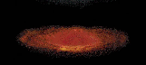

5. Centrale bol wordt een ster

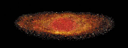

6. Ontstaan protoplaneten door samenklonteren
materiaaldeeltjes

7. Straling blaast lichte elementen weg -> vaste
klonters botsen en vormen rotsplaneten

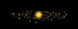

8. Lichte elementen (gas) in de buitenste zone
vormt gasreuzen

### 2.2 De bouw van de zon
- **Kern**: fusie van waterstof -> ontstaan helium en grote stralingsenergie (elektromagnetische straling)
- **Fotosfeer** = zonneoppervlak (6000 °C)
    - Soms donkere zonnevlekken (4000 °C)
- **Chromosfeer**: onderste laag van atmosfeer -> **Protuberansen** door hoge druk en temperatuur

- **Corona** = buitenste deel van de zonneatmosfeer. Gloed het ijle gassen

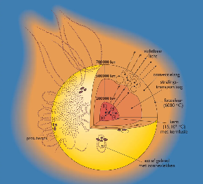

- **Zonnewind** = stroom van geladen deeltjes zonnematerie die ontsnappen van de zon 
-> Tegengehouden door het magnetisch veld van de aarde 
-> Onstaan **poollicht**

### 2.3 Planeten in ons zonnestelsel

- **Planetenstelsel** = één/meerdere sterren en de planeten die er rond draaien
- Voorwaarden om van een planeet te spreken
    - Draait in een baan om de zon
    - Voldoende massa om door zwaartekracht een bolvorm te hebben
    - Puin in de baan moet opgeruimd zijn

-> Indien niet = **dwergplaneet**
- **Manen** = hemellichamen die in een baan rond een planeet

- **Rotsplaneten** = Mercurius, Venus, Aarde en Mars
- **Gasreuzen** = Jupiter, Saturnus, Uranus, Neptunus
- Verder van de zon = langere omlooptijd
- Rotatietijd verschilt
- Weerkaatsen licht van de zon

- **Aarde** = bewoonbare zone (Goldilockszone) + vloeibaar water + juiste opbouw en samenstelling

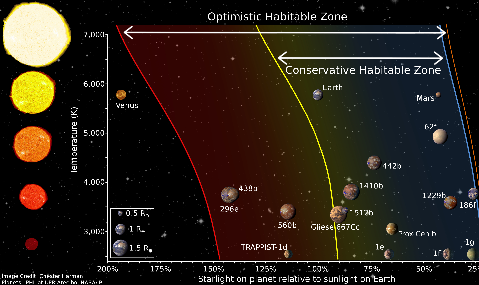

### 2.4 Puingordels in ons zonnestelsel
**Geen leerstof**

### 2.5 Andere verschijnselen in ons zonnestelsel
- **Meteoroïden** = brokstukken van een komeet/planetoïde (ruimtesteen) van IJzer of steen
- **Meteoren** (vallende sterren) = Meteoroïden die de dampkring binnendringen
- **Meteoriet** (afbeelding) = meteoroïde die niet opgebrand is in de dampkring en het oppervlak bereikt

- Vaak klein en onvindbaar
- Soms groot met grote gevolgen voor het leven op aarde (afbeelding: inslag die het einde maakte aan de dino's)

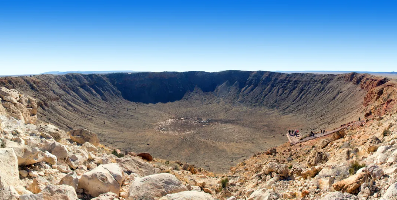

- **Kometen** = "vuile sneeuwbal" (1-10km dik) met een aan rond de zon -> dicht bij de zon ontstaat er sublimatie van ijs waardoor wolk van gas en ijs ontstaat -> stofstaart van miljoenen kilometers vormt zich = **coma**

-> als deze langs de aarde komt gaan de stofdeeltjes de atmosfeer binnen en krijg je een **meterorenzwerm**

- **Planeten** -> vb. aarde, neptunus, ... (afstand: 1-150 AE)
- **Planetenstelsel** -> ons zonnestelsel
- **Sterrenstelsel** -> melkwegstelsel ± 100 000 diameter met 100en miljarden sterren
- **Cluster** -> "lokale groep" met 28 andere sterrenstelsels
- **Heelal** met diameter 92 miljard lichjaren/LJ

---

### Hoofdstuk 3 - Ontstaan van en evolutie van het heelal

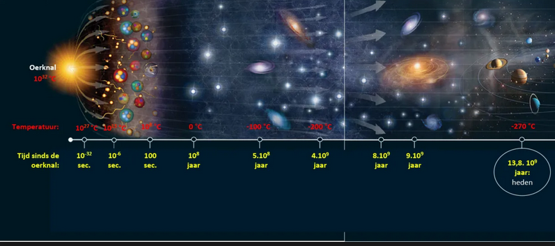

### Verloop
1. Enorme druk en temperatuur in één punt -> zeer snelle expansie =
Big Bang/Oerknal
2. Heelal breidt uit en koelt af -> ontstaan elementaire deeltjes
(neutronen en protonen) en later atomen -> licht kan ontsnappen
3. Zwaartekracht zorgt voor vorming wolken waarin sterrenstelsel
ontstonden (zie vorige leerstof)
4. Sterrenstelsels sterven uit waarbij zwaardere elementen uitgestoten worden (IJzer, koolstof, aluminium) -> ontstaan nieuwe sterren
5. Na 9 miljard jaar: versnelling uitbreiding heelal

### Bewijzen voor de Big Bang
- **Roodverschuiving**: verlaging van lichtfrequentie bij het weggaan van sterren (een rodere kleur)

- **Microgolfachtergrondstraling**: erg zwakke microgolven als overblijfsel van Big Bang
- Datering op 13,8 miljard jaar geleden

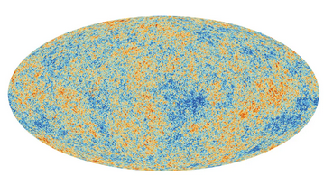

---

## Thema 2 - Bewegingen van aarde en maan

---

### Hoofdstuk 1 - De aardrotatie

### 1. Waarnemingen

### 1.1 De zon overdag
- **Dagboog**: schijnbare beweging van de zon aan de hemelkoepel (O   Z   W)
- Middag = **culminatiehoogte**/**CH**(in het zuiden)
- **Zenit** = punt boven de waarnemer

**België (50°NB)**:
- Lente/Herfst (± 40°CH) = dag van 12u
- Zomer (± 63°CH) = dag langer dan nacht
- Winter (± 17°CH) = nacht langer dan dag

### 1.2 De sterrenhemel tijdens de nacht
- **Sterren**: ook schijnbare baan rond **Poolster** (O - Z -W)

-> Lig in het verlengde van de aardas

### 2. Van schijnbare beweging naar echte beweging

### Van schijnbare beweging naar echte beweging
- Sterren bewegen niet echt -> beweging is de **aardrotatie**
- Denkbeeldige **aardas** loopt door Noord-Zuidpool
- Draait rond zijn as in 24u (**1/dag**)

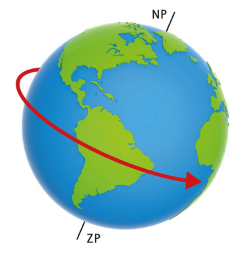

### 3. Gevolgen van de aardrotatie

### 3.1 Plaatsbepaling op aarde
- **Breedtecirkels**: geven OOST/WEST richting aan
- **Meridianen** of **Middaglijnen**: (hebben middag op hetzelfde moment) -> Geven ZUID/NOORD richting aan
- Coördinatenstelsel: 0-punten
    - **Evenaar** -> Noordelijk en Zuidelijk halfrond (90°N en 90°Z)
    - **Nulmeridiaan** -> Westelijk en Oostelijk halfrond (180°W en 180°E)

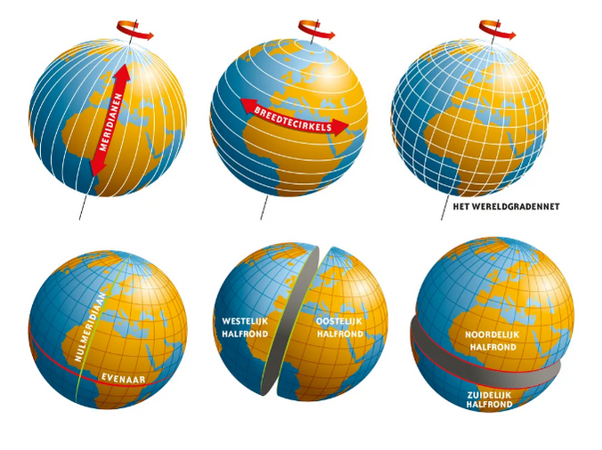

- Ligging van een punt op aarde t.o.v nullijnen
- **Breedteligging** -> afstand van punt to evenaar (afhankelijk van halfrond N of S)
- **Lengteligging** -> afstand van punt tot nulmeridiaan (afhankelijk van halfrond W of E)

### 3.2 Afwisseling dag en nacht
- Ongeveer 50% van de aarde is steeds belicht door bolorm

### 3.3 Tijdsbepaling op aarde
- **De zonnetijd**: tijd gebaseerd op culminatiehoogte -> niet handig om iedereen met zonnetijd te laten werken
- Gebruik van tijdzones -> theoretische tijdzone met **zonetijd**
    - **Elke tijdzone** = 15° breed en 1 uur lang
    - **Westen** = vroeger ; **Oosten** = later
    - **UTC-zone** rond de meridiaan -> België = UTC   

- De conventionale of lokale tijd
    - West-Europa = UTC+1
    - Kan wisselen met **zomer/wintertijd**

- Uurzones in België
    - Theoretische zone: UTC
    - Winteruur: UTC +1
    - Zomeruur: UTC +2

-> Vooral om economische redenen

- **Datumgrens** = meridiaan van 180° 
-> Datum veranderd bij oversteken van Oost naar West

### 3.4 Afbuiging van de winden en zeestromen

- Snelheid waarmee aarde draait hangt af van breedteligging 

-> **Evenaar = 1656 km/u**, **Noordpool = 0 km/u**
- **Corioliseffect**: afbuigen van wind en zeestromingen door de snelle rotatie van de aarde
    - **Noorden**: stroom buigt naar rechts
    - **Zuiden**: stroom buigt naar links

### 3.5 Afplatting van de aarde

- Aarde is geen perfecte bol door de rotatie 

-> uitzetting aan evenaar, afplatting polen

---

### Hoofdstuk 2- De aardrevolutie

### 1. Schijnbare versus werkelijke beweging
- Verschil in **culminatiehoogte** afhankelijk van seizoen 

-> uren daglicht verschillen op verschillende plekken door
    - **Aardrevolutie** = omwentelingen van aarde rond de zon
    - Schuine aardas

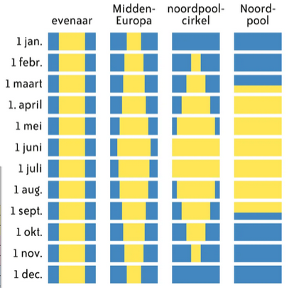

### 2. De ellipsvormige baan van de aarde rond de zon
- **Baan rond de zon** = ellipsvormig
- Denkbeeldig vlak dat afgebakend word door de aardbaan: **eclipticavlak**
- Afstand bepaald niet de seizoenen

-> Januari dichts bij de zon

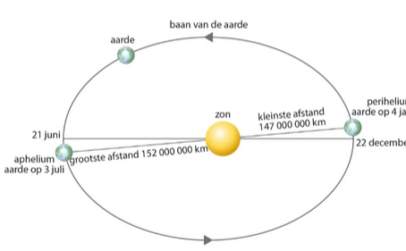

### 3. De aardrevolutie bepaalt het kalenderjaar
- Baan ronde de zon duurt 365 dagen - 5uur - 48 minuten en 46 seconden = **aards jaar**
- Praktisch 365 dagen = **kalenderjaar**

-> MAAR te kort
    - **Schrikkeljaren** met één extra dag om de 4 jaar 

    -> te grote compoensatie 
        -> eeuwjaren, behalve **deelbaar door 400, worden geen schrikkeljaren**

### 4. De schuine stand van de aardas veroorzaakt de seizoenen

- Hoek van aardas met lijn loodrecht op **Eclipticavlak** = 23° 26'
- Noordpool en Zuidpool hebben maar één half jaar licht

### 4.1 Lente en herfst equinox
- Dag en nacht duren 12 uur op heel de wereld
- 23 september en 20 juni
- **Noordelijk halfrond**: lente-equinox op **20 maart** en herfst-equinox op **23 september**
- **Zuidelijk halfrond**: lente-equinox op **23 september** en herfst-equinox op **20 maart**

### 4.2 Zomerzonnewende op het Noordelijk Halfrond
- Zonnestralen vallen loodrecht op **kreeftskeerkring** = kring waarop de zon keert en de dagen terug korter worden
- Zon gaat niet onder ten noorden van de noordpoolcirkel voor minstens 24u
- Dagen lager dan de nacht in Noordelijk Halfrond
- Dagen korter dan de nacht in Zuidelijk Halfrond

### 4.3 Winterzonnewende op het Noordelijk Halfrond
- Zonnestalen van loodrecht op Steenbokskeerkring
- Zon gaat niet onder ten Zuiden van de Zuidpoolcirkel voor minstens 24u
- Dagen langer dan de nacht in Zuidelijk Halfrond
- Dagen korter dan de nacht in Noordelijk Halfrond

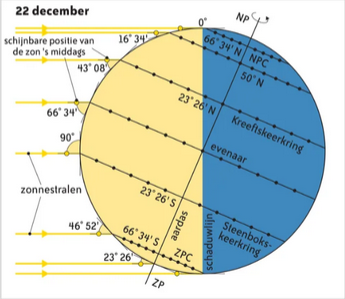

### 5. Culminatieverschillen bepalen de klimaathoogte op aarde
- Richting Zuidpool/Noordpool daling van culminatiehoogte

-> invloed op temperaturen -> verdeling in **klimaatgordels**
- **Polaire klimaten**: van poolcirkels tot polen - lage temperaturen doorheen het jaar
- **Gematigde klimaten**: tussen keerkringen en poolcirkels - grote temperatuurverschillen tussen winter en zomer. Verschillende daglengtes
- **Tropische klimaten**: van de keerkringen tot de evenaar - heel jaar door hoge temperaturen

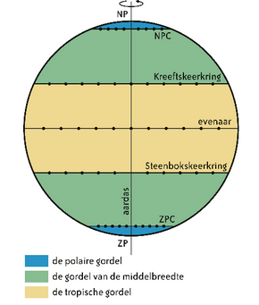

---

## Thema 3 - Atmosferische processen

---

### Hoofdstuk 1 - De opbouw van de atmosfeer

### 1. Onze atmosfeer: levensnoodzakelijk
- Laag van gassen rond de aarde die door zwaartekracht niet kunnen ontsnappen (1000 km hoogte)
- Dichtheid neemt af met hoogte -> atmosfeer word ijler
- Samenstelling:
    - 78% stikstof
    - 21% zuurstof
    - 1% andere (argon, CO2, waterdamp, ...)
- Belang voor ons
    - Ozonlaag (door UV-straling op zuurstof)
    - Fotosynthese
    - Meteorietinslagen

### 2. Op verkenning in de lagen van de atmosfeer

### 3. Ozon: een bescherming of bedreiging?
**Geen leerstof**

---

### Hoofdstuk 2 - Warmte op aarde

### 1. De stralingsbalans
- **Stralingsbalans** = evenwicht tussen inkomende kortgolvige straling en uitgaande langgolvige straling
- **Albedo** = onmiddelijk teruggekaatste straling (ongebruikte energie) -> wolken, stofdeeltjes, witte oppervlaktes

- Andere straling -> omgezet naar langgolvige straling

-> Wordt op de aarde gehouden als warmte door **broeikasgassen** = **natuurlijk broeikaseffect**

-> Toename broeikasgassen en bijgehouden warmte door menselijke activiteit = **versterkt broeikaseffect**

- Aarde zelf warmt onderste luchtlaag op

### 2. Temperatuurverdeling op aarde

### 2.1 Breedteligging
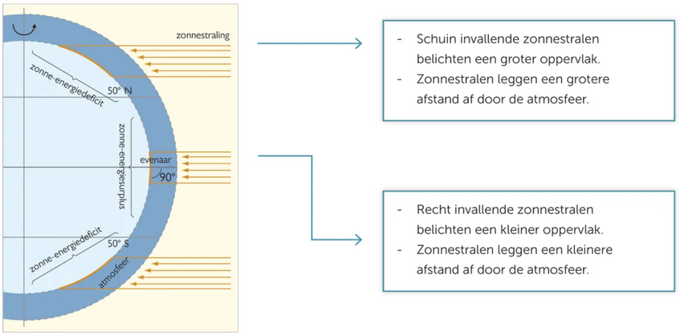

### 2.2 Tijdstip van de dag (zonnetijd)
- Warmste moment = 2 uur nadat de zon de culminatiehoogte heeft bereikt

-> Omzetten van licht naar warmte heeft tijd nodig

### 2.3 Oriëntatie helling
**Geen leerstof**

### 3. Ligging ten opzichte van de zee
- Verder van de zee = warmere zomers en koudere winters
- Zee verzacht temperaturen
    - Zee koelt traag af in de winter -> geeft warmte af
    - Zee warmt traag op in de zomer -> koelend effect

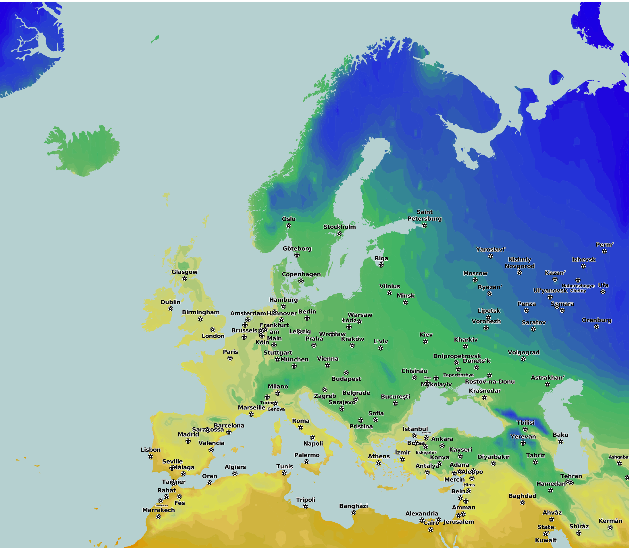

### 3.1 Invloed van zeestromingen
- Uitwisseling van warmte tussen de evenaar en de polen
- Warme **golfstroom** houdt Europa warmer in de winter dan Oostkust van de Verenigde Staten

### 3.2 Invloed van hoogteligging
- Per **180m** stijging daalt de temperatuur **1 °C**

### 4. Invloed van de bodem
- Albedo-effect reflecteert straling -> minder opwarming
- Bij absorptie -> opwarming
- Vegetatie reflecteert minder MAAR warmt trager op door opname ven straling door fotosynthese
- Donkere oppervlakten weerkaatsen minder licht en warmen sterker op

---

### Hoofdstuk 3 - Warmtecirculatie op aarde

### 1. Het ontstaan van drukverschillen
- **Luchtdruk** = gewicht van lucht per m² (uitgedrukt in hPa) -> **Zeeniveau** = ~ 1012 hPa
    - Hoger dan 1013 hPa = **Hogedrukgebied**
    - Lager dan 1013 hPa = **Laagdrukgebied**

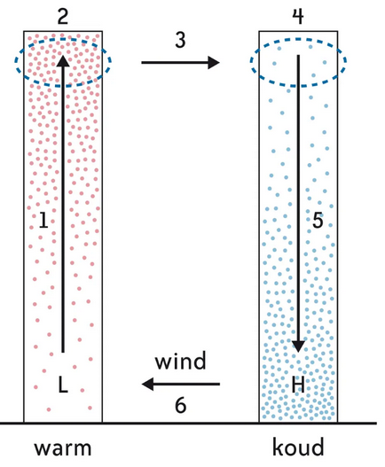

Ontstaan wind:
1. Warmte lucht stijgt door opwarming
2. Warmte lucht verplaatst zich bovenaan
3. Warme luchtkolom weegt minder onderaan -> ontstaan lage druk (L)
4. Lucht stroomt naar koude luchtkolom
5. Luchtkolom gaat aan de grond meer wegen -> ontstaan hoge druk (H)
6. Lucht verplaatst zich onderaan naar het lagedrukgebied = **wind**

### 2. De luchtcirculatie toegepast op de aarde
- Stilstaande aarde: opwarming aan evenaar -> winden van polen naar evenaar (2 circulatiecellen)

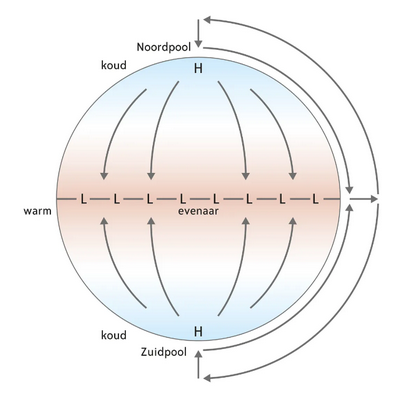

- 3 circulatiecellen per halfrond
- A: Warmte lucht stijgt aan de evenaar -> vloeit af naar de polen tot 30°

-> afkoeling en daling ontstaan hogedrukgebied 

-> lucht stroomt gedeeltelijk terug naar de evenaar

- B: overgebleven lucht op 30°N beweegt naar Noordpool -> Komt op 60°N koude poollucht tegen

-> stijgende luchtbeweging waardoor lagedrukgebied ontstaat

-> lucht vloeit deels zuidelijk waardoor circulatiecel sluit

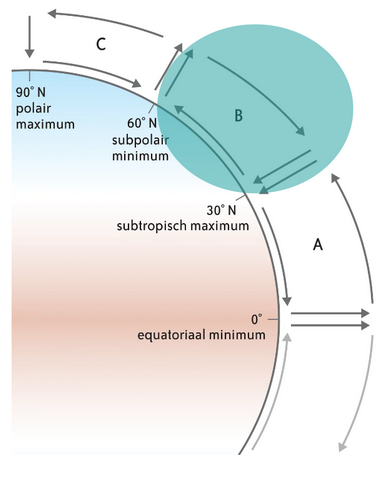

- C: lucht op 60°N die in de hoogte noordwaarts vloeit koelt sterk af en daalt boven Noordpool

-> Waait richting 60°N

-> Ontstaan derde circulatiecel

- **Corioliseffect** -> winden buigen af
    - Voorbeeld. Noorderwinden worden Noordoostenwinden in het Noordelijk Halfrond tussen keerkring en evenaar = **passaat**
    - Bij ons: Zuid-Westenwind die primeert

### 3. Van theoretisch model naar realiteit
**Geen leerstof**

### 4. Zeestromingen
- **Golfstroom**: Zeestromingen herverdelen warmte in oceean-atmosfeer systeem -> stroming door winden aan oppervlak oceanen
- Voorbeeld. Golfstroom -> **valt samen met Zuidwesten winden** tussen keerkring en polen

- **Thermohaliene circulatie**
    - Thermo = temperatuur
    - Halien = zout

-> Zeestromingen aangedreven door verschillen in temperatuur en zoutgehalte
- Voorbeeld. Water van goldstroom wordt koeler en zouter bij de polen -> zakt en wordt afgevoerd naar de tropen

---